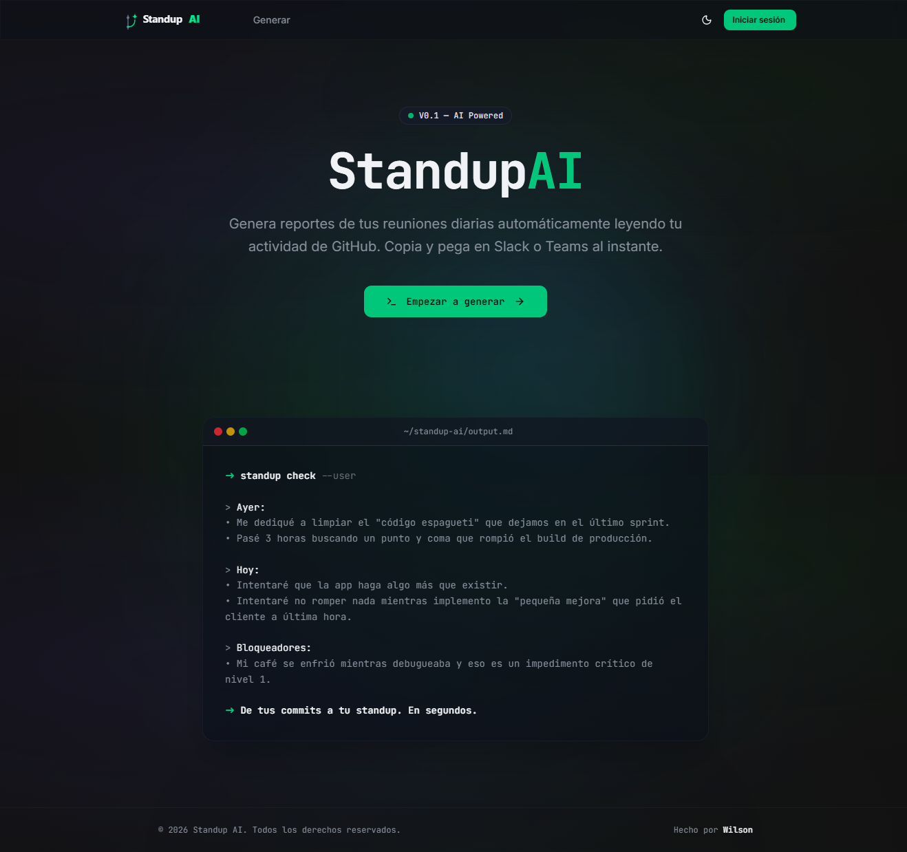
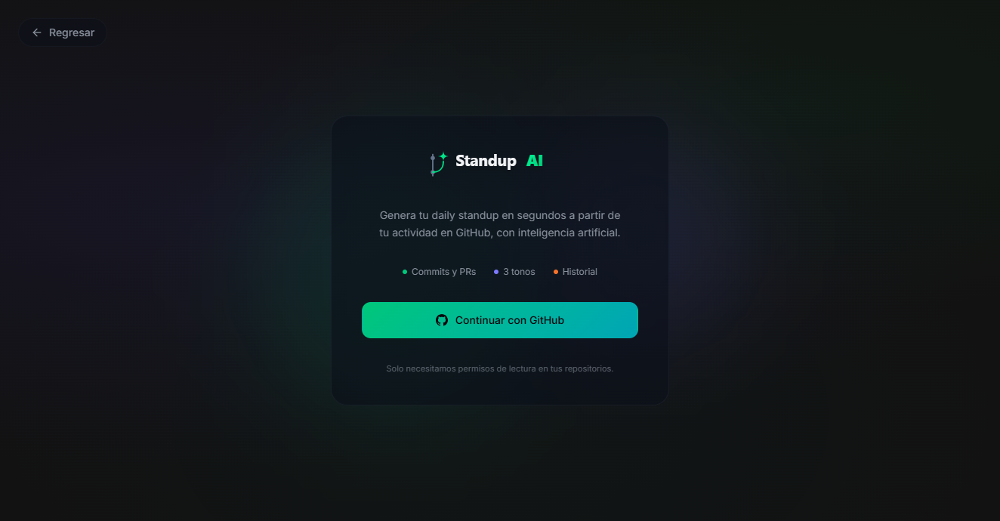
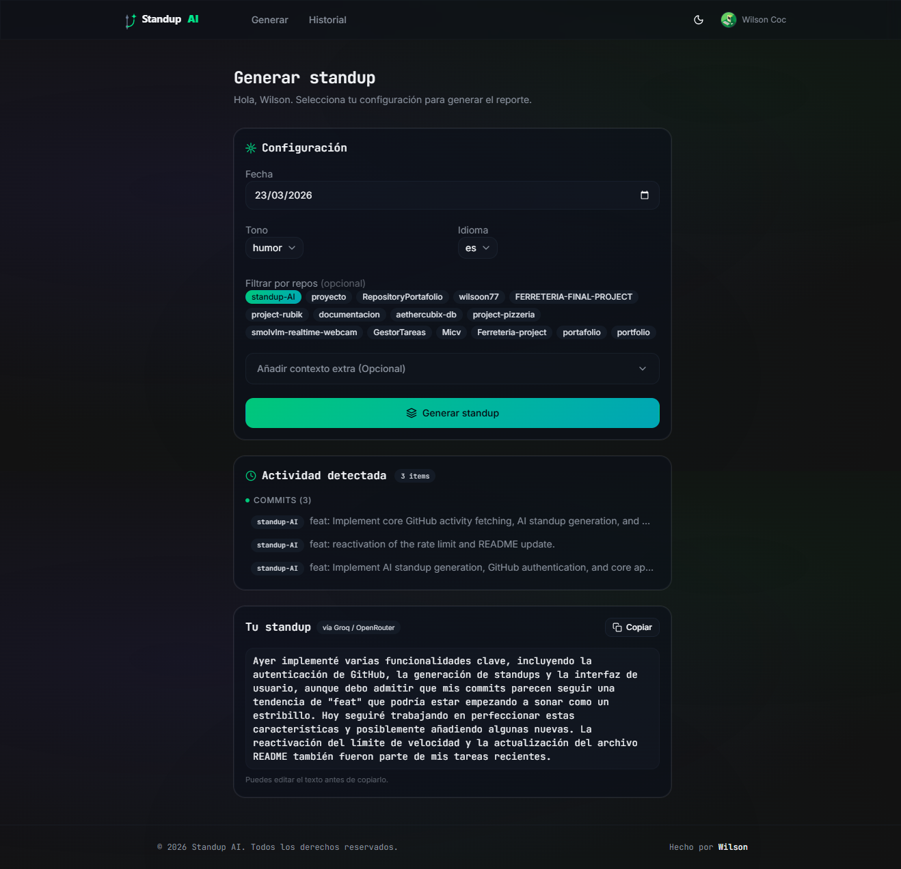
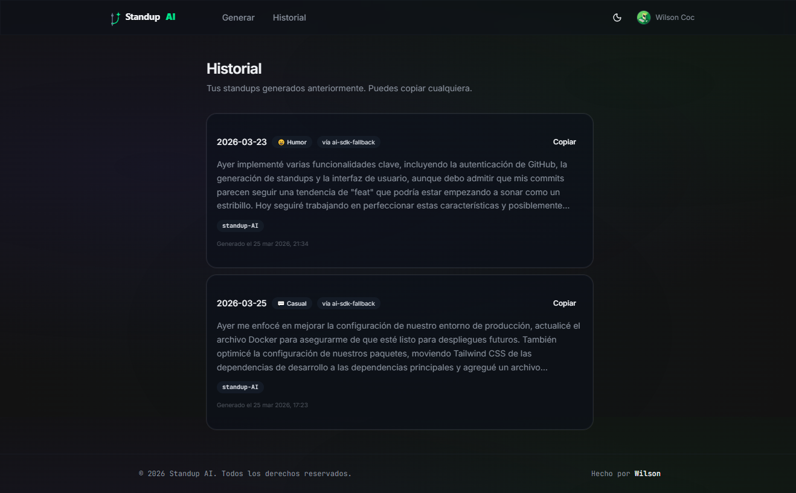

# Standup AI
> De tus commits a tu daily standup en segundos.

Una aplicación web impulsada por Inteligencia Artificial que lee tu actividad en GitHub (commits, Pull Requests, Issues) y genera automáticamente un reporte de "Daily Standup" listo para copiar y pegar en Slack o Teams.

Usa **Groq** para una generación ultrarrápida (usando `llama-3.3-70b-versatile`) con **OpenRouter** como opción de respaldo.

## ¿Qué problema resuelve?
 
Todo desarrollador ha vivido esto: son las 9:59am, el standup empieza en un minuto y no recuerdas qué hiciste ayer. Standup AI conecta tu cuenta de GitHub y genera el texto por ti — con el tono que prefieras y basado en tu actividad real.
 
---
 
## Capturas Demo



### Página Login


### Página Principal


### Página de Historial


---
## Características

- 🔐 Autenticación segura vía GitHub OAuth para guardar historial
- 🧩 Versión de prueba para usuarios no logueados
- 🌐 Soporte para múltiples idiomas (Español e Inglés)
- 📊 Integración nativa con GitHub API para traer tu trabajo al instante
- 🤖 Generación asistida por IA usando Llama 3 (Groq + OpenRouter)
- 🎭 Selector de tonos: Formal, Casual, o Con Humor
- 💿 Guarda todos tus reportes anteriores en el historial de forma segura localmente (Solo para usuarios logueados)
- 🎨 UI con Dark Mode, UI diseñada para devs
- 🔒 Seguridad Anti-Prompt-Injection al enviar bloqueos personalizados
- 🛡️ Rate Limiter de protección API (5 reportes por invitado y 15 para usuarios registrados)
- 🐳 Optimización para despliegue usando Docker

---


## 🛠️ Tecnologías Usadas

- **Frontend & Framework**: Next.js 15 (App Router), React 19, TypeScript
- **Estilos & UI**: Tailwind CSS v4, Lucide Icons, Glassmorphism UI
- **IA & APIs**: Groq (Llama 3), OpenRouter (Fallback), Vercel AI SDK
- **Integraciones**: GitHub REST API, NextAuth (Auth.js)
- **Base de Datos**: libSQL autoalojado (SQLite) + Drizzle ORM
- **🚀 Infraestructura y Despliegue**: Esta aplicación ha sido diseñada y optimizada para ser alojada y ejecutada en **CubePath** como servidor principal para garantizar su estabilidad y rendimiento en producción + coolify como orquestador de contenedores.

**¿Por qué CubePath?**
- Un solo VPS aloja tanto la app como la BD — sin servicios externos de BD
- Coolify instalado desde el Marketplace de CubePath con 1 click
- Auto-deploy configurado desde GitHub en cada push a `main`
- SSL automático con Let's Encrypt vía Coolify

---

## 🚀 Roadmap / Future Features Que se pueden agregar

- **Integraciones Adicionales (Jira/Linear)**: Soporte planeado para cruzar ramas y commits automáticamente con tickets de trabajo.
- **Exportación Nativas**: Botones para generar y exportar el reporte con formato nativo garantizado para Slack, Microsoft Teams y WhatsApp.
- **Plantillas Personalizables (Templates)**: Capacidad de guardar templates de standups según el formato único que necesite tu equipo (ej. "Ayer/Hoy/Dificultades" vs "Logros/Metas").

## 🧠 Mejorando el Formato de la IA (Escalabilidad de Prompts)

Toda la base de los reportes es controlable desde los Prompts de Sistema localizados en `lib/ai/index.ts`. Puedes escalar y mejorar el comportamiento del modelo modificando este archivo. Algunas opciones de escalabilidad futura incluirian:

1. **Formato Nativo para Slack**: Modificar el prompt para exigir que envuelva nombres de repositorios en \`backticks\` y usar viñetas precisas.
2. **Formato Orientado a Tareas (Feature-Oriented)**: Forzar a la IA a agrupar los commits no por orden cronológico, sino agrupados bajo la "Feature" o componente que hayan modificado.
3. **Formateo JSON Estricto**: Hacer que responda con una estructura JSON en caso de querer alimentar otro sistema (como crear tickets automáticos en Jira a partir del standup).
4. **Resaltado Markdown**: Escalar la interfaz de la aplicación actual para soportar pestañas de "**Raw**" (Copiable) y "**Preview**" (Renderizado visual de todo el Markdown).

---

## 📌 Para Correr Localmente
### Prerequisitos
 
Necesitas estas API keys gratuitas:
 
| Servicio | Dónde obtenerla |
|---|---|
| GitHub OAuth App | [github.com/settings/developers](https://github.com/settings/developers) |
| Groq API Key | [console.groq.com](https://console.groq.com) |
| OpenRouter API Key | [openrouter.ai/keys](https://openrouter.ai/keys) |
 
### Instalación
 
```bash
# 1. Clonar el repositorio
git clone https://github.com/wilsoon77/standup-AI.git
cd standup-AI
 
# 2. Instalar dependencias
npm install
 
# 3. Configurar variables de entorno
cp .env.example .env.local
# Llenar .env.local con tus API keys
```
 
### Variables de entorno
 
```bash
NEXTAUTH_SECRET=           # openssl rand -base64 32
NEXTAUTH_URL=http://localhost:3000
AUTH_TRUST_HOST=true
 
GITHUB_CLIENT_ID=          # De tu OAuth App en GitHub
GITHUB_CLIENT_SECRET=
 
GROQ_API_KEY=              # De console.groq.com
OPENROUTER_API_KEY=        # De openrouter.ai
 
TURSO_DATABASE_URL=file:local.db
TURSO_AUTH_TOKEN=          # Dejar vacío en local
```
 
### Iniciar
 
```bash
# Crear base de datos local
npm run db:generate
npm run db:migrate
 
# Iniciar servidor de desarrollo
npm run dev
```
 
Abre [http://localhost:3000](http://localhost:3000).
 
---
 
## Scripts
 
| Comando | Descripción |
|---|---|
| `npm run dev` | Servidor de desarrollo |
| `npm run build` | Build de producción |
| `npm run db:generate` | Generar migraciones desde el schema |
| `npm run db:migrate` | Aplicar migraciones a la BD |
| `npm run db:studio` | UI visual para explorar la BD |
 
---